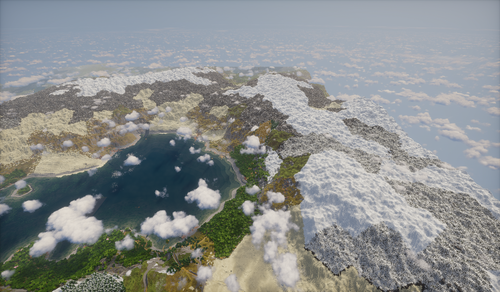
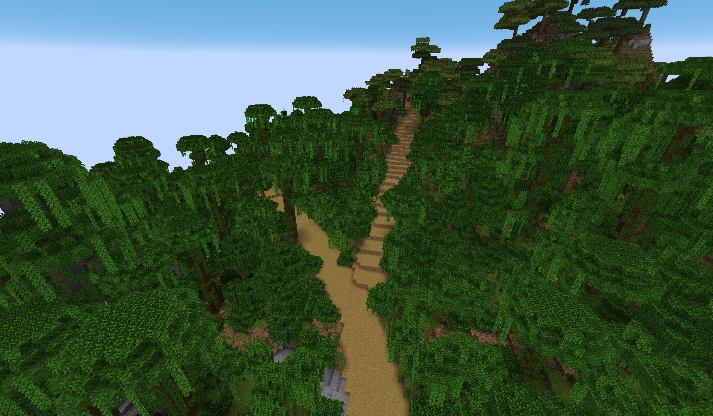
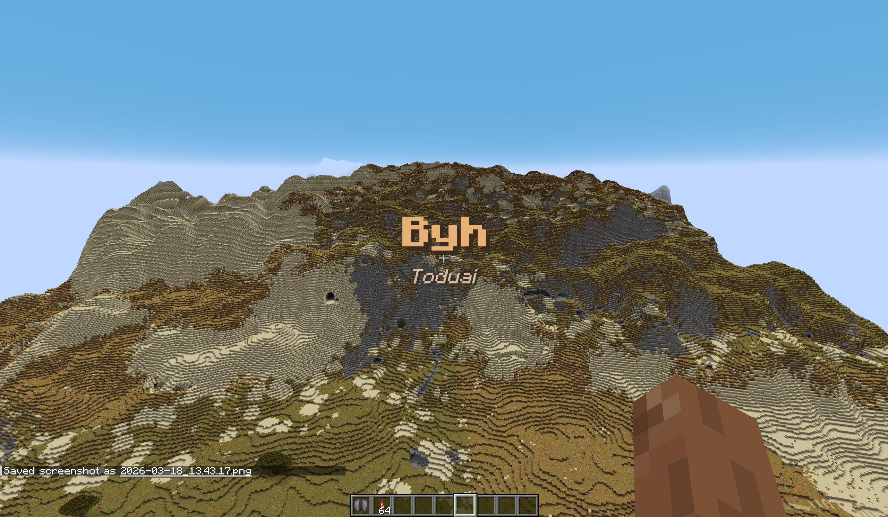
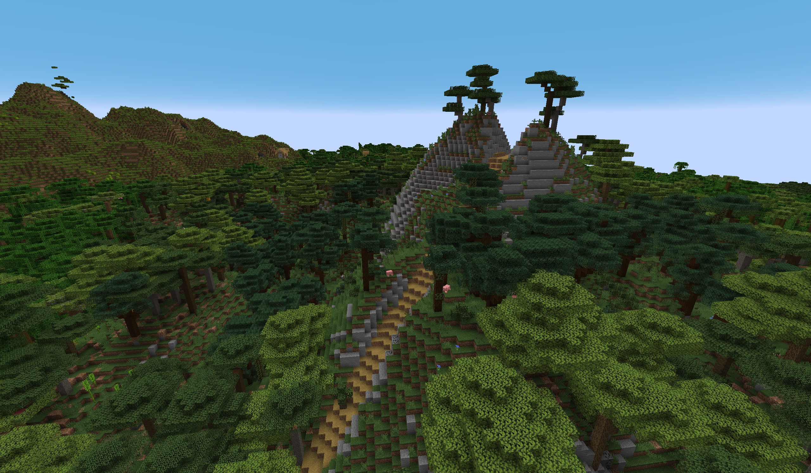
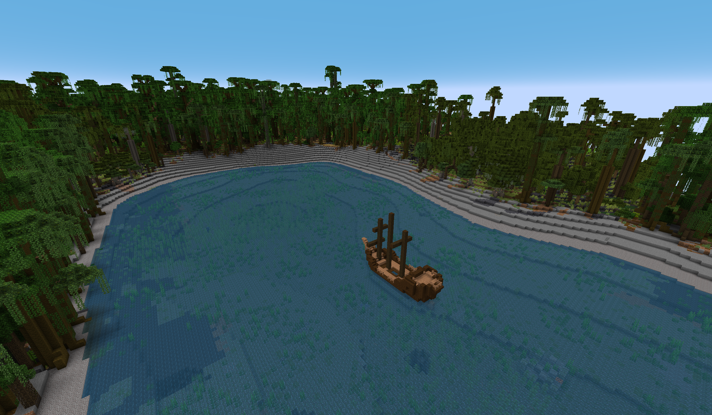

# Fantasy Map Generator (Fabric)

A fabric mod to generate a Minecraft overworld from a **Fantasy Map Generator (FMG)** JSON export from Azgaars fantasy map generator.

- **Minecraft**: 1.21.4 (is currently most up to date)
- **Mod loader**: Fabric (`fabricloader >= 0.18.4`)
- **Requires**: Fabric API
- **Java**: 21+

---

## Gallery

### FMG overview (zoomable)

This is an **HD/partial-load** FMG view so you can zoom in and see the paths + biome layout clearly (a “what this will look like in a full world” preview).


### In-game screenshots







### Map examples (less detailed)

These are additional map examples (less detailed than the HD overview above), useful to illustrate different layouts.


## Install (Singleplayer)

1. Install **Fabric Loader** for Minecraft **1.21.4**.
2. Download/install **Fabric API**.
3. Put this mod’s `.jar` in your `.minecraft/mods` folder.
4. Launch the game once (this creates the config file).

---

I would highly recommend installing william wythers overhauled overworld as well https://modrinth.com/mod/wwoo/ as it introduces better biome blending/shading and good looking sub biomes as well, using this generation mod without it makes the biomes look off. Even if you use both the game stays perfectly vanilla block and item wise.
## Quickstart: play on your FMG map

### 1) Export your map from FMG

From Fantasy Map Generator, export a **Full JSON** (the same kind of export that contains states/provinces/biomes/burgs).

Put the exported `.json` file somewhere inside your Minecraft instance folder (recommended):

- `.minecraft/config/fantasymapgenerator/YourMap.json`


### 2) Point the mod to your JSON export

After first launch, edit:

- `.minecraft/config/fantasymapgenerator/config.json`

Set `mapJsonPath` to your export.

Example:

```json
{
  "mapJsonPath": "C:/Users/ExampleUser/Downloads/YourMap.json",
  "sampleScale": 12.0
}
```
Mind the directino of the slashes, it has to be forward slashes.

Restart Minecraft after changing the file.

### 3) Create a new world using the preset

Create a new singleplayer world and select the **“Fantasy Map”** world preset.

- The mod ships a built-in datapack/resource pack that adds this preset.
- Nether and End remain vanilla; only the Overworld is replaced.


NOTE: generating can take a while
---


## Implemented features

Current functionality in this template:

- **Custom Overworld preset** (“Fantasy Map”) that uses FMG-backed worldgen.
- **FMG-backed terrain height**: surface elevation is projected from the FMG export instead of vanilla noise.
- **FMG-backed biome selection**: surface biomes are chosen from FMG map data.
- **Burg-based villages**: a custom structure places jigsaw villages at FMG **burg** locations (with a flatness check, this does mean some burgs do not spawn).
- **Region title popups**: when a player crosses into a different **state/province**, the mod shows a title + subtitle.
- **Configurable map path override** via `config/fantasymapgenerator/config.json`.

Missing functionality:
- **Rivers** 
- **1.18 noise caves instead of just spaghetti caves**
---

## Switching burg villages to a custom "castle" template

This mod’s burg placement is a jigsaw structure (`fantasymapgenerator:burg_village`) whose *start pool* is picked from:

- `.minecraft/config/fantasymapgenerator/villages.json`

The repo includes a built-in `castle` type that places a **single structure template** (currently a vanilla placeholder: the pillager outpost watchtower) via:

- [src/main/resources/data/fantasymapgenerator/worldgen/template_pool/castle/start_pool.json](src/main/resources/data/fantasymapgenerator/worldgen/template_pool/castle/start_pool.json)

To use it, set (or add) in `villages.json`:

- `defaultVillageTypes`: `["castle"]`

To replace the placeholder with your own castle build:

1. In-game, save your build with a **Structure Block**.
2. Export it to a datapack/mod resource at `data/fantasymapgenerator/structures/castle/castle_01.nbt`.
3. Update the pool element’s `location` to `fantasymapgenerator:castle/castle_01`.


## Troubleshooting

- **World creation crashes or says it can’t find the FMG export**:
  - Make sure the file exists at the path in `mapJsonPath`.
  - If using a relative path, it is resolved relative to the **Minecraft instance directory** (usually `.minecraft/`).
  - Restart Minecraft after changing the config.

- **No region titles show up**:
  - Region titles only appear in dimensions using the FMG chunk generator (the “Fantasy Map” preset overworld).


## License

See `LICENSE`.
